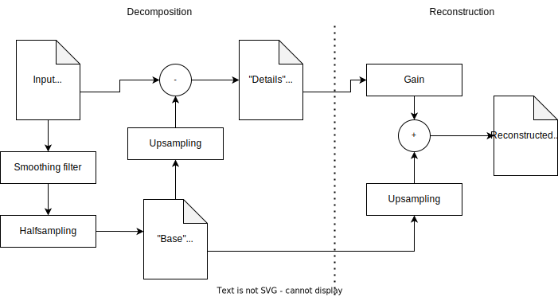

# Preamble

The goal of this lab work is to become familiar with a simple way to harness power of GPUs for image processing: *GLSL shaders in WebGL*.

We will be using a restricted and easy-to-learn subset of GLSL features, sufficient to implement algorithms operating on a neighborhood of a given output pixel.

We do not focus on performance and code optimization in this lab work.

# Introduction

We will be writing small programs (shaders) responsible for constructing output images pixel by pixel. The managing code providing inputs to these programs and calling them will be in JavaScript.

## GLSL quick start

Here is a bottom-up introduction to GLSL shaders.

```glsl
precision highp float;

// input image texture
uniform sampler2D inputImage;

// texture coordinates corresponding to the current output pixel position
varying vec2 texCoord;

void main() {
  // sample the input image
  vec4 color = texture2D(inputImage, texCoord);

  // shuffle color channels and write out
  gl_FragColor = color.bgra;
}
```

* GLSL is much like C. There are functions, variables `if`s and loops (`while` and `for`).
* `float foo;` is a variable declaration of fractional scalar type `float`.
* We will manipulate `float`-based quantities using types like `float`, `vec2`, `vec3`, and `vec4`, representing scalar, 2-, 3-, and 4-component vector data respectively.
  * Vector components can be referred to as `r`, `g`, `b`, `a`. For example, if we have a `vec4 stuff`, then `stuff.r` is its first component, `stuff.g` is its second component, and so on.
  * `stuff.rg`, `stuff.gb`, `stuff.gg` are valid `vec2` constructs consisting of corresponding components of variable `stuff`, while `stuff.rgb`, `stuff.bgr`, `stuff.bbb` etc. are all valid `vec3` values.
  * For vectors storing coordinates rather than colors, `x`, `y`, `z` and `w` can be used instead of `r`, `g`, `b`, `a`. This is only for readability and has no impact on the behavior of the resulting program. As we mainly operate with colors, we stick to the `rgba` notation in what follows.
* Common binary arithmetic operations (`+`, `-`, `*`, `/`) are defined for vector expressions of the same length, as well as for vector/scalar pairs. `*` and `/` perform pointwise multiplication and division. `dot(foo, bar)` returns a dot product of vectors `foo` and `bar`.
* A special global variable `texCoords` of type "`varying vec2`" specifies the current output pixel position in 0..1 normalized coordinates. This variable is not a part of the GLSL specification: it comes from a predefined vertex shader specifically for this lab work.
* The `uniform` specifier defines read-only variables during shader execution. Their values are set before running the shader program.
  * `uniform sampler2D` is a variable referring to an input texture image. A shader may have multiple such variables, to read from multiple textures.
  * `texture2D()` is a function used to read pixels (`vec4` values) from a texture, and is a part of the GLSL standard. The following code is idiomatic: `vec4 inputColor = texture2D(inputTexture, texCoords);`
  * The output sampling gird and the values `texCoords` may take are fully conditioned by the size of the output texture bound to the shader. When sampling an input image of a different size, the `texture2D()` function is set to perform *bilinear interpolation* of the input pixels.
  * You may declare and use the `uniform vec2 pixelStep` variable containing the pixel displacement to add to (or subtract from) the `texCoords` variable to get the neighbor pixel coordinate. If declared in your shader, `pixelStep` will be automatically filled with the right value. This is not a part of the standard.
* The `void main()` function is the entrypoint (a shader may have other functions too). It is run for every pixel of the *output texture*.
  * `gl_FragColor` is a `vec4` variable defining the current *output* pixel color. In this work, this variable is the only way for programs to provide output. Assigning a value to this variable is the primary responsibility of `main`. `gl_FragColor` is a part of the GLSL specification.
  * In this lab work we will use 8-bit images, implying that every component of the output texture is internally stored as a 8-bit value. Consequently, `gl_FragColor` is automatically clipped into 0..1 range before the pixel color value is written to the output texture.

For more details refer to the [GLSL ES 1.0 quick reference card](https://www.fsynth.com/pdf/webgl1_glsl_1.pdf).

## Managing code

To execute GLSL programs, a host environment is required. We use WebGL in this work: it is widely available, OS- and hardware-independent, and does not require any specific software like a compilation toolchain. Any common modern web browser integrates the WebGL support.

The programs are embedded into an HTML document. Check `example_basic.html` and `example_with_controls.html` for reference.

 * Input images are loaded using ``. They are referenced using `id` attributes (required to be unique).
 * GLSL source code is placed into `<script>` tags with `type="x-shader/x-fragment"` and unique `id` attributes.
 * The managing code, situated within a large `<script>` block, constructs programs, assigns inputs, and launches their execution.
 * `<input>` elements can be used to add knobs to the page, in order to control uniform variables of shader programs. They are referenced by their `id`s.

WebGL intricacies are abstracted through predefined functions:

 * `buildProgram(shaderScriptTagId)` constructs and returns a GLSL program from the source code taken from a given `shaderScriptTagId`.
 * `makeTextureFromImage(imgTagId)` loads an image with a given id into a texture usable in programs.
 * `makeEmptyTexture(width, height)` allocates an empty texture of a given size in pixels. Such textures can be used as outputs of programs.
 * `runProgram(program, inputs, output)` executes a `program` taking `inputs` object and storing the result to `output` texture.
   * `inputs` is a mapping of uniform variable names to their values. The values can be textures (for `sampler2D` variables), numbers (for `float`s) or arrays (for `vec*` variables).
   * The last argument is optional. If omitted, the program output will be displayed on the screen.
 * `displayTexture(texture)` can be used to display a given texture to the screen.
 * `getKnobValue(inputId)` can be used to retrieve the value of a knob added with an `<input>` tag with a given `inputId`.


# Exercise 1 (warm-up): 256 Shades of Gray

 * Write a program converting a colorful image into a grayscale one.
 * Try out different ways to map colors to gray values.
 * Take inspiration from `example_with_controls.html` to make the conversion parameters tunable.
 * What is the "best" way to map colors to gray? Share your observations.


# Exercise 2: Bass, Mid, Treble



Decomposing images into "base" and "details" is a common operation in many imaging algorithms. We first generate a blurred version of an input image by applying a low-pass filter. It can then be subsampled with no risk of aliasing, providing a coarse-scale "base" image (low-resolution representation of the input). Taking difference of the upsampled "base" and the input image provides a "details" image, containing a high-frequency component of the input.

The original input image can be perfectly reconstructed from its "base" and "details" counterparts.

The decomposition into base/details can then be applied in a recursive fashion, taking "base" as a new input at every iteration. This leads to a multiscale pyramidal representation of the input, with "details" at multiple scales and a "base" image which can be as small as 1*1 pixel.

Likewise, we can perfectly reconstruct the original input from its pyramidal representation, starting from the coarse scale "base", upsampling it, adding "details", upsampling again, etc.. Also, if we apply a multiplicative factor to the details at every scale during the reconstruction, we can amplify or attenuate certain frequencies in the reconstructed image.

**Exercise**: make an "equalizer". A set of programs computing the multiscale representation of the input image and applying gains to the corresponding scales to control the amount of "basses", "mids" and "trebles" in the reconstructed image.
